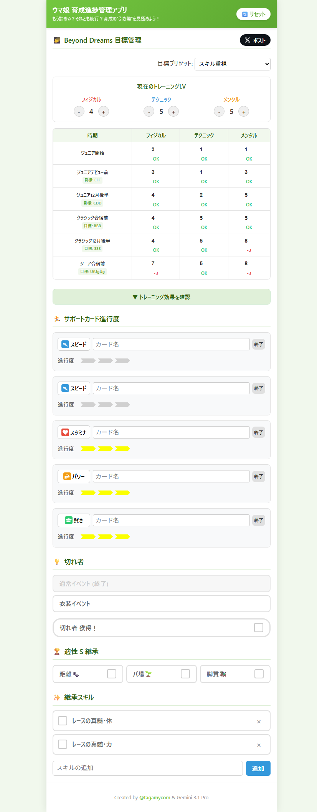

# UMA Planner

ゲームウマ娘の育成サポートおよび進捗管理を行うための非公式Webアプリケーションです。
育成の”引き際”を見極め、設定した目標ステータス（トレーニングLvやサポートカードの進行度）に向けて効率的に管理・トラッキングできるツールを提供します。
スマートフォンでの見やすさを重視し、横に置いて片手で操作しやすいUI（PWA対応）を採用しています。

<div align="center">
  
</div>

## 🌐 Sample Site

実際に稼働しているサンプルサイト（デモ）はこちらからご利用いただけます。
👉 **[https://uma.tagamy.com](https://uma.tagamy.com)**

---

## � 使い方 (How to Use)

本アプリのご利用方法は大きく分けて2通りあります。

### 1. このまま使いたい場合
上記のサンプルサイトにブラウザでアクセスするだけで、すぐにご利用いただけます。
> **Note:** アプリに入力した進捗やセーブデータは**すべてご利用のブラウザ内（ローカル）に保存**されます。外部のサーバーへ送信されることは一切ありません。

### 2. 自分用にカスタマイズしたい場合
ご自身で使いやすくUIや機能を改造したい方は、お気兼ねなく `clone` や `fork` してコードを修正・利用いただいてOKです！
改変したコードを利用したり、改変物を再配布していただくことも問題ありません。（自由度の高いOSSとして公開しています）

---

## �🚀 Getting Started

このアプリをローカル環境で動かすための手順です。本プロジェクトは React + TypeScript + Vite で構築された静的Webサイト（SPA）です。

### 1. 依存関係のインストール

プロジェクトをクローン後、ディレクトリ内で以下のコマンドを実行し、必要なパッケージをインストールします。

```bash
npm install
```

### 2. ローカルサーバーの起動 (開発環境)

以下のコマンドを実行して開発用サーバーを立ち上げます。

```bash
npm run dev
```

ターミナルに表示されるURL（デフォルトでは `http://localhost:5173/` など）にブラウザでアクセスしてください。ファイルを編集すると自動で画面がリロードされ変更が反映されます。

### 3. プロダクションビルド

本番環境用に最適化されたビルドを行うには以下のコマンドを実行します。

```bash
npm run build
```

コマンド完了後、`dist` ディレクトリ内にビルドファイルが生成されます。
このファイルを任意のWebサーバー（Amazon S3 + CloudFront、Vercel、GitHub Pagesなど）にデプロイすることでサイトとして公開できます。
