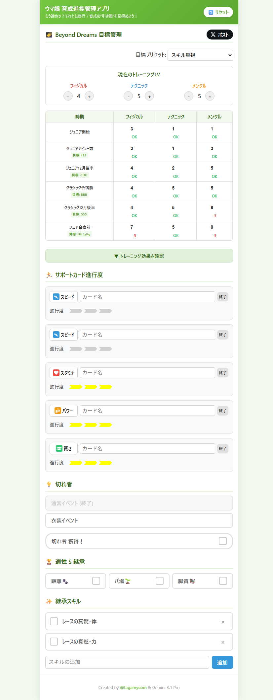

# UMA Planner

ゲームウマ娘の育成サポートおよび進捗管理を行うための非公式Webアプリケーションです。
新シナリオ「大豊食祭～走れ！ウマ娘～（トレセン軒編）」や「Beyond Dreams」に対応し、育成の”引き際”を見極め、設定した目標ステータス（トレーニングLvやサポートカードの進行度）に向けて効率的に管理・トラッキングできるツールを提供します。
さらに、育成完了後のスコアや各シナリオごとの独自の記録（ラーメン作成履歴など）をスプレッドシート用に一括出力（TSV出力＆コピー）できる機能を備えています。
スマートフォンでの見やすさを重視し、横に置いて片手で操作しやすいUI（PWA対応）を採用しています。

<div align="center">
  
</div>

## 🌐 Sample Site

実際に稼働しているサンプルサイト（デモ）はこちらからご利用いただけます。
👉 **[https://tagamy.github.io/uma-planner/](https://tagamy.github.io/uma-planner/)**

---

## 使い方 (How to Use)

本アプリのご利用方法は大きく分けて2通りあります。

### 1. このまま使いたい場合
上記のサンプルサイトにブラウザでアクセスするだけで、すぐにご利用いただけます。
> **Note:** アプリに入力した進捗やセーブデータは**すべてご利用のブラウザ内（ローカル）に保存**されます。外部のサーバーへ送信されることは一切ありません。

### 2. 自分用にカスタマイズしたい場合
ご自身で使いやすくUIや機能を改造したい方は、お気兼ねなく `clone` や `fork` してコードを修正・利用いただいてOKです！
改変したコードを利用したり、改変物を再配布していただくことも問題ありません。（自由度の高いOSSとして公開しています）

### 3. フォークして自分のGitHub Pagesで公開したい場合
本リポジトリには GitHub Pages へ自動デプロイするためのワークフローが組み込まれています。
フォークしたご自身のリポジトリで以下の設定を行うだけで、あなた専用のURLでアプリを公開できます！

1. このリポジトリを **Fork** する
2. リポジトリの **Settings** ＞ **Pages** を開く
3. **Build and deployment** の Source を `GitHub Actions` に変更する
4. **Actions** タブを開き、ワークフローの実行を許可する（`I understand my workflows...`）
5. これだけで、以降は `main` ブランチにプッシュするたびに自動デプロイが行われます🚀

---

## 🚀 Getting Started

このアプリをローカル環境で動かすための手順です。本プロジェクトは React + TypeScript + Vite で構築された静的Webサイト（SPA）です。

### 1. 依存関係のインストール

プロジェクトをクローン後、ディレクトリ内で以下のコマンドを実行し、必要なパッケージをインストールします。

```bash
npm install
```

### 2. ローカルサーバーの起動 (開発環境)

以下のコマンドを実行して開発用サーバーを立ち上げます。

```bash
npm run dev
```

ターミナルに表示されるURL（デフォルトでは `http://localhost:5173/` など）にブラウザでアクセスしてください。ファイルを編集すると自動で画面がリロードされ変更が反映されます。

### 3. プロダクションビルド

本番環境用に最適化されたビルドを行うには以下のコマンドを実行します。

```bash
npm run build
```

コマンド完了後、`dist` ディレクトリ内にビルドファイルが生成されます。
このファイルを任意のWebサーバー（Amazon S3 + CloudFront、Vercel、GitHub Pagesなど）にデプロイすることでサイトとして公開できます。

---

## 変更履歴 (Changelog)

- **2026-06-30**
  - 新シナリオの「235の法則」に基づいた、地域選択を一発で設定できる「おすすめプリセット機能」を追加しました
  - UI上に「235の法則」の解説を展開して読める機能を追加しました

- **2026-06-29**
  - トレセン軒編の「ラーメンのコツ所持数」を管理できるコンポーネントを復活させました
  - コツ管理コンポーネントのUI（ボタンの視認性、レイアウト、余白）を改善しました
  - 記録データ（TSV形式）の出力テキストエリアが画面外にはみ出す問題を修正しました

- **2026-06-28**
  - 新シナリオ「大豊食祭～走れ！ウマ娘～（トレセン軒編）」に対応しました
  - トレセン軒編の「ご当地ラーメン作成回数」をジュニア・クラシック・シニアの各枠ごとに記録できる機能を追加しました
  - 育成完了時の成績やサポカ編成、ラーメン作成回数をまとめて記録し、スプレッドシートなどにコピペできる「TSV出力＆コピー機能」を追加しました
  - 不要となった旧機能（コツ管理、夏合宿・試食会準備、RMJ盛況度など）を整理し、UIを最適化しました
